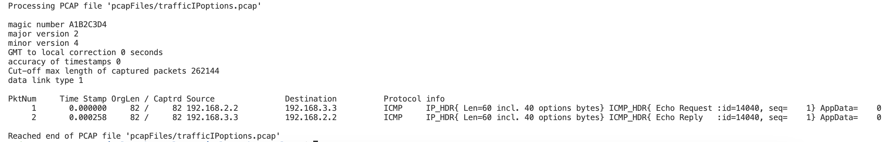

# Simple Packet Analyzer
In this project, I implemented a simple packet analyzer program that deconstructs a PCAP file into a human readable packet summary. This project was developed for my Advanced Computer Networking (CS-455) class at JMU.

## My Contributions
The majority of code in the project files was written by me. I developed the processes to read in and store packets, extract information from packet headers, and print useful packet summary information to the user.

## Other Contributors
This project was designed by my CS-455 Professor, Dr. Mohamed Aboutabl. Dr. Aboutabl designed the structure of the project as a whole, wrote the mypcap.h header file, and provided the sample PCAP files listed in the "pcapFiles" directory.

## Skills Demonstrated
1. C Programming Language
2. Computer Networking
3. Systems Application Development

## Program Execution
#### Example of ARP and ICMP Packets being Analyzed

#### Example of ICMP Packets with IP Options being Analyzed

#### Example of UDP and TCP Packets being Analyzed

#### Example of Mixed Packets being Analyzed

## How to Use
This program can be run by downloading the source files, running the makefile (compiles the mypcap.c and simplePacketAnalyzer.c files into an executable), and running the executable with a pcap file as a command line argument.
#### Example
1. `make`
2. `./simplePacketAnalyzer pcapFiles/trafficMixed.pcap`

*Note: Requires gcc compiler*
